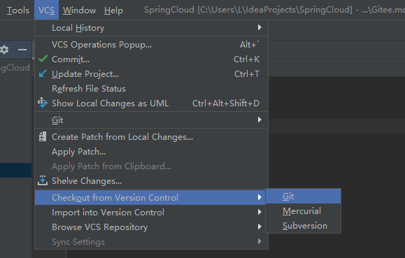
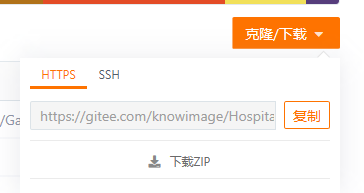
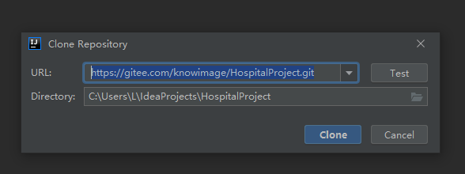
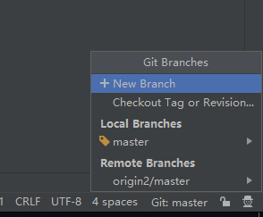
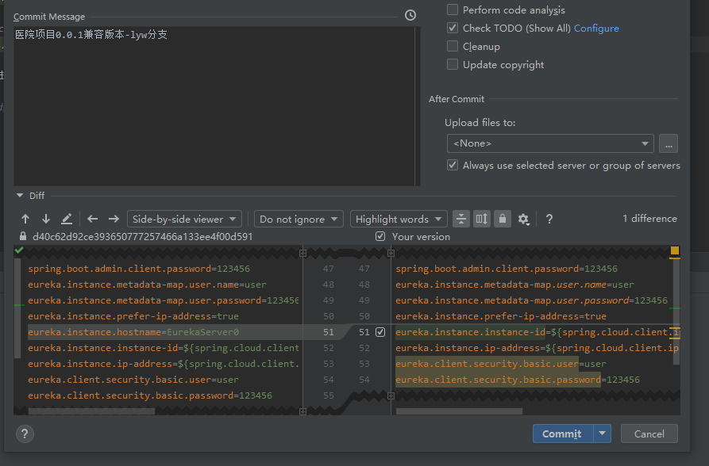
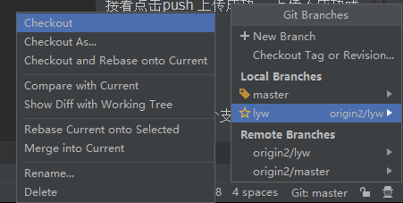
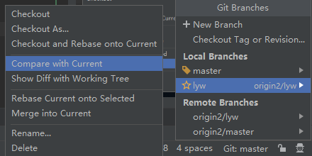
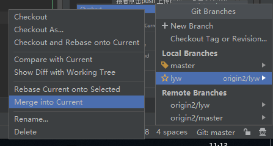

## Gitee 医院项目使用方法

- 作者 罗运帷

###在Gitee上拉取项目
####第一步

####第二步 输入gitee医院项目中的地址

点击clone 此时可能会要求输入gitee账号密码 输入即可

####第三步 项目clone成功后 新建分支

输入分支名称 点击确定即可 此时当前分支 已切换为刚刚新建的分支。

####第四步 将本地分支上传到远程仓库上
ctrl + k

输入commit message后 点击commit可选项中的commit and push

接着点击push 上传成功。 
上传不成功就找我。

###合并分支

####第一步 当前先切换到主分支 （！！！ 注意 切换之前一定要提交当前分支的修改）

####第二步 更新主分支 ctrl+t

####第三步 检查主分支与合并分支的区别

####第四步 合并分支到主分支

####第五步 将主分支本地仓库提交到远程仓库

ctrl + k

- 有问题找我

